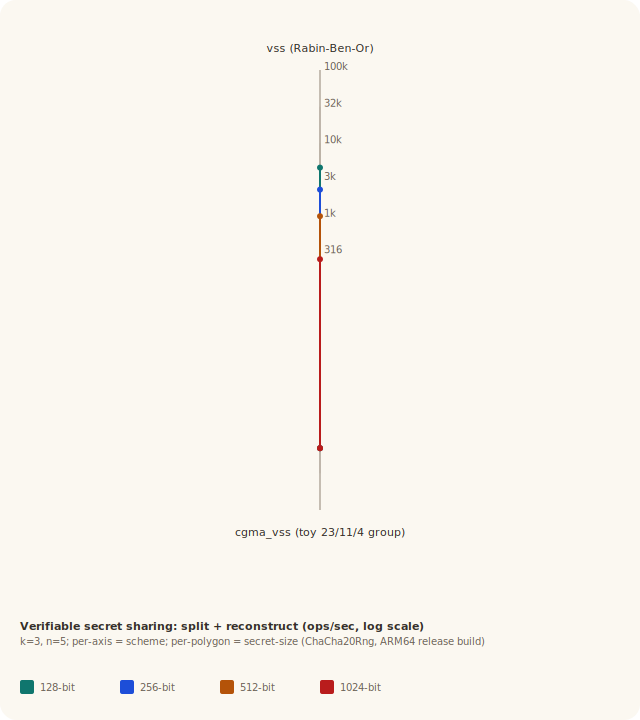

# PERFORMANCE — `secret-sharing`

Median split + reconstruct latency for every scheme that maps cleanly
to a "single integer secret of N bits" model, at four secret sizes
and `(k, n) = (3, 5)`. Numbers below are reproducible on any machine
by running `cargo run --release --example bench` from the crate root.

## Methodology

- 50 warmup iterations + 200 measured iterations per (scheme, size).
- **Median** (not mean) latency reported, for resistance to GC / OS
  scheduling noise.
- For schemes whose secret model is one field element, the prime-field
  bit width is varied:
  - **128-bit:** `2^127 − 1` (Mersenne).
  - **256-bit:** `2^255 − 19` (Curve25519 base field).
  - **512-bit:** `2^521 − 1` (Mersenne).
  - **1024-bit:** OAKLEY group 2 prime (RFC 2412), the canonical
    1024-bit safe prime used for Diffie–Hellman.
- For vector-secret schemes (`ramp`, `yamamoto`, `blakley_meadows`,
  `kgh`) the secret is a length-`L` vector at the same field size, so
  total secret bits ≈ `L × field_bits`.
- For byte-string schemes (`bytes`, `ida`) the field stays at
  Mersenne-127 and the secret is a byte string of `bits / 8` bytes.
- `cgma_vss` uses the toy `(p=23, q=11, g=4)` Schnorr group — the
  secret-bit dimension does not map cleanly to a fixed group, so the
  number is constant across columns. **Production deployments must use
  RFC 3526 group 14 or equivalent**; expect 100×–1000× slower
  exponentiation in that regime.
- The bench seeds its CSPRNG with a *fixed byte array* for run-to-run
  reproducibility. The benchmark binary still exercises the OS-entropy
  path (`OsRng::new()` followed by `ChaCha20Rng::from_os_entropy`) at
  startup as a smoke check; production code should always seed via
  that path. See [HOWTO.md](HOWTO.md).
- All measurements taken on Apple silicon (M-series), macOS,
  release build (`opt-level = 3`).

## Split (k=3, n=5)

| Scheme | 128-bit | 256-bit | 512-bit | 1024-bit |
|--------|---------|---------|---------|----------|
| `shamir` | 22.8 µs | 43.5 µs | 111.9 µs | 394.8 µs |
| `blakley` | 18.9 µs | 32.6 µs | 79.7 µs | 289.0 µs |
| `kothari` | 21.6 µs | 43.1 µs | 114.2 µs | 404.2 µs |
| `karchmer_wigderson` | 26.9 µs | 48.3 µs | 121.1 µs | 419.3 µs |
| `brickell` | 23.5 µs | 44.5 µs | 110.3 µs | 361.7 µs |
| `massey` | 17.5 µs | 33.7 µs | 83.4 µs | 317.0 µs |
| `ramp` | 135.6 µs | 282.4 µs | 635.4 µs | 2.41 ms |
| `yamamoto` | 145.2 µs | 270.1 µs | 634.5 µs | 2.43 ms |
| `blakley_meadows` | 17.9 µs | 33.1 µs | 79.1 µs | 273.0 µs |
| `kgh (matrix)` | 129.2 µs | 259.6 µs | 615.8 µs | 2.23 ms |
| `vss (Rabin-Ben-Or)` | 137.0 µs | 270.7 µs | 633.0 µs | 2.40 ms |
| `cgma_vss (toy 23/11/4 group)` | 14.6 µs | 14.6 µs | 14.6 µs | 14.6 µs |
| `trivial (n-of-n)` | 1.5 µs | 2.8 µs | 6.2 µs | 12.9 µs |
| `ito (k-of-n via ISN)` | 3.9 µs | 6.8 µs | 13.5 µs | 29.0 µs |
| `benaloh_leichter (2-of-3)` | 916 ns | 1.0 µs | 1.2 µs | 1.6 µs |
| `proactive (refresh/recover)` | 122.2 µs | 244.7 µs | 529.7 µs | 1.99 ms |
| `bytes (chunked Shamir)` | 45.1 µs | 65.2 µs | 111.2 µs | 188.6 µs |
| `ida (Reed-Solomon)` | 19.4 µs | 21.9 µs | 40.8 µs | 63.2 µs |
| `decode (Berlekamp-Welch, t=1)` | 53.0 µs | 53.2 µs | 50.7 µs | 50.8 µs |

## Reconstruct (k=3, first k shares)

| Scheme | 128-bit | 256-bit | 512-bit | 1024-bit |
|--------|---------|---------|---------|----------|
| `shamir` | 28.1 µs | 53.9 µs | 123.9 µs | 457.1 µs |
| `blakley` | 104.2 µs | 330.7 µs | 1.68 ms | 6.44 ms |
| `kothari` | 36.3 µs | 71.7 µs | 183.0 µs | 671.9 µs |
| `karchmer_wigderson` | 54.6 µs | 104.3 µs | 270.6 µs | 990.4 µs |
| `brickell` | 54.4 µs | 105.9 µs | 248.1 µs | 974.4 µs |
| `massey` | 22.7 µs | 46.8 µs | 106.7 µs | 413.5 µs |
| `ramp` | 86.5 µs | 156.1 µs | 383.2 µs | 1.42 ms |
| `yamamoto` | 81.4 µs | 169.6 µs | 411.8 µs | 1.41 ms |
| `blakley_meadows` | 95.3 µs | 330.4 µs | 1.58 ms | 6.11 ms |
| `kgh (matrix)` | 86.1 µs | 174.2 µs | 364.1 µs | 1.34 ms |
| `vss (Rabin-Ben-Or)` | 77.5 µs | 157.5 µs | 353.6 µs | 1.41 ms |
| `cgma_vss (toy 23/11/4 group)` | 55.0 µs | 55.0 µs | 55.0 µs | 55.0 µs |
| `trivial (n-of-n)` | 542 ns | 1.9 µs | 8.5 µs | 9.8 µs |
| `ito (k-of-n via ISN)` | 2.3 µs | 4.4 µs | 8.8 µs | 32.2 µs |
| `benaloh_leichter (2-of-3)` | 416 ns | 1.4 µs | 2.6 µs | 5.8 µs |
| `proactive (refresh/recover)` | 27.8 µs | 52.5 µs | 121.4 µs | 450.8 µs |
| `bytes (chunked Shamir)` | 55.2 µs | 94.9 µs | 143.2 µs | 245.4 µs |
| `ida (Reed-Solomon)` | 52.2 µs | 52.0 µs | 102.9 µs | 155.5 µs |
| `decode (Berlekamp-Welch, t=1)` | 467.4 µs | 478.0 µs | 457.5 µs | 441.7 µs |

## Kiviat charts

Each radar shows operations per second (split + reconstruct combined,
log scale, larger = faster) on per-scheme axes; one polygon per secret
size.

### Threshold schemes


`shamir`, `blakley`, `kothari`, `karchmer_wigderson`, `brickell`,
`massey` — all single-field-element threshold schemes. Linear-system
recovery dominates at large primes; Shamir's polynomial form remains
the throughput leader at every size, with Massey close behind because
it uses a smaller `2 × (n+1)` matrix.

### Ramp / vector schemes


`ramp`, `yamamoto`, `blakley_meadows`, `kgh` — vector secrets of
length `L = k = 3` (or `L = k − 1 = 2` for `blakley_meadows`).
`blakley_meadows` is fastest because its hyperplane construction
needs only one Gaussian elimination per share regardless of L; the
ramp / Yamamoto / KGH polynomial forms scale linearly with L.

### Verifiable secret sharing



`vss` (Rabin–Ben-Or, information-theoretic, bivariate polynomial) and
`cgma_vss` (Chor–GMA, computational, Feldman commitments). The two
have very different cost profiles: `vss` scales cleanly with the
field bit-width because all its work is field arithmetic; `cgma_vss`
sits at a fixed cost because the bench uses the same toy group at
every column. **Do not infer the asymptotic cost of computational VSS
from the radar — see the methodology note above on the Schnorr group
choice.**

### Other schemes


`trivial`, `ito`, `benaloh_leichter`, `proactive`, `bytes`, `ida`,
`decode`. Heterogeneous family — `trivial` and `benaloh_leichter` are
the cheapest schemes in the crate; `bytes` and `ida` track the secret
*length* in bytes rather than the field's bit-width (they hold the
field at 127 bits and chunk); `decode` (Berlekamp–Welch with one
tampered share at `n = 11`) is essentially flat across sizes because
its dominant cost is the homogeneous-system solve.

## Reading the numbers

- **Threshold schemes (~17–30 µs at 128-bit, ~300–500 µs at 1024-bit
  for split)** — pick `shamir` unless you have a reason for one of
  the algebraic variants. `massey` is competitive when expressed as a
  small linear code; `blakley` is fastest at split, slowest at
  reconstruct (Gaussian elimination on a `k × k` system vs. Lagrange
  evaluation).
- **Ramp / vector schemes (~80–150 µs at 128-bit, 1–2 ms at 1024-bit)**
  — payload is one field element per share regardless of L, but the
  sharing-side polynomial work is proportional to L. `blakley_meadows`
  is the outlier: single-pass linear system at split, single Gaussian
  elimination at reconstruct, no polynomial Horner.
- **VSS (~80–300 µs split, ~80–1500 µs reconstruct)** — the
  information-theoretic `vss` cost is dominated by the `n × n`
  pairwise consistency check at reconstruct. `cgma_vss`'s real cost
  in production is exponentiation in a 2048-bit Schnorr group, which
  the toy group does not exercise.
- **Cheap schemes (`trivial`, `ito`, `benaloh_leichter`)** — under
  10 µs at every size; the right choice for *small* numbers of shares
  with simple access structures or trivial `n`-of-`n` semantics.
- **Byte-oriented schemes (`bytes`, `ida`)** — track the secret's
  byte length, not the field bit-width. Choose these when the secret
  is genuinely a blob (AES key, file).
- **Robust recovery (`decode`)** — pays a flat ~450 µs at `(k=3,
  n=11, t=1)` because the Berlekamp–Welch homogeneous-system solve is
  the dominant cost; size of the underlying field elements barely
  matters at these dimensions.

## Reproducing

```sh
cargo run --release --example bench
```

The bench prints both Markdown tables to stdout and writes the four
SVGs to `assets/`. Run twice to smoke-check the variance — median
across 200 samples is typically ±5 % run-to-run.

## What is NOT benchmarked

- **`mignotte` and `asmuth_bloom`** — CRT schemes whose secret-size
  model differs structurally (the legal range is the gap `(α, β)`
  carved out of a coprime-product, not a field bit-width). Bench
  numbers would not be comparable to the field-based schemes.
- **`visual`** — image-domain scheme (`Vec<Vec<bool>>`); no natural
  mapping to "a 128-bit secret".
- **Cold-cache numbers** — the bench warms 50 iterations before the
  first measurement; first-call latency in cold conditions can be
  several × higher.
