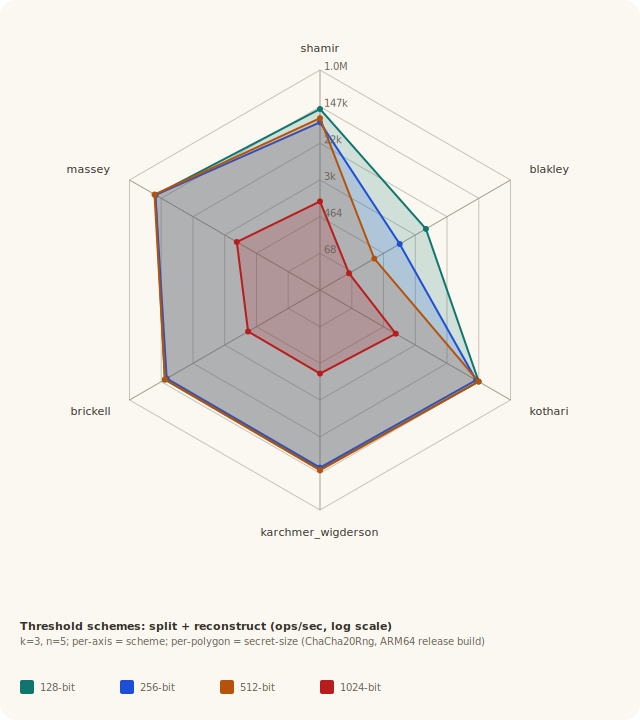
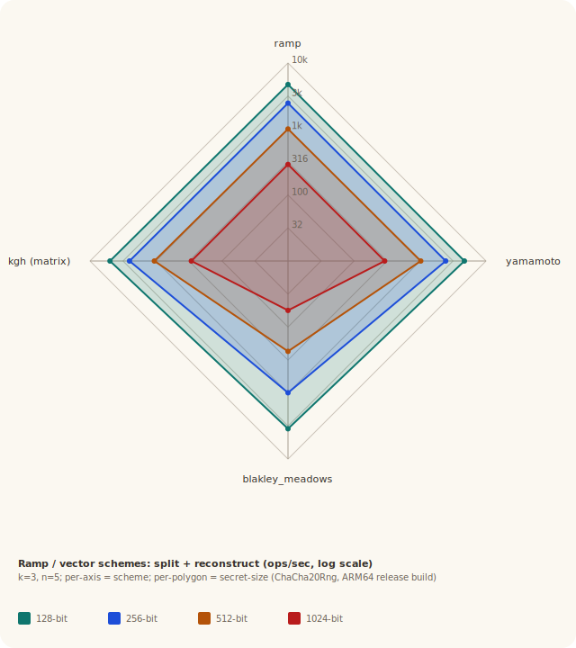
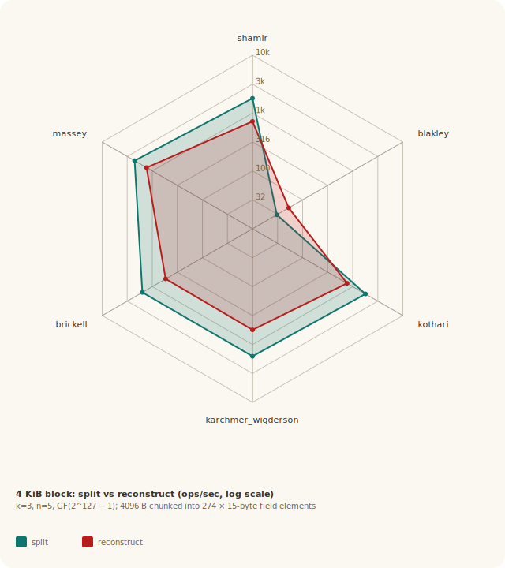

# PERFORMANCE — `secret-sharing`

The authoritative measurement layer is
[`pilot-bench`](https://github.com/darrelllong/pilot-bench): each
operation is driven repeatedly until a 95 % confidence interval of
≤ 20 % of the mean is reached. Numbers below report **mean ms/op**,
**±CI (95 %)** half-width, and the number of pilot rounds the
framework decided were needed to reach that interval. Lower is
better throughout.

## Reproducing

```sh
# Build the operation dispatcher.
cargo build --release --bin pilot_ss

# Drive it through pilot-bench (assumes pilot-bench at $HOME/pilot-bench).
bash scripts/bench_pilot.sh > benchmarks/pilot_ss_latest.md
```

Environment knobs honoured by `scripts/bench_pilot.sh`:

| Variable | Default | Effect |
|---|---|---|
| `PILOT_BENCH_CLI` | `$HOME/pilot-bench/build/cli/bench` | Path to the `bench` binary |
| `PILOT_SS_BIN` | `target/release/pilot_ss` | Path to the dispatcher |
| `PILOT_PRESET` | `quick` | `quick` (20 % CI / 30 samples), `normal` (10 % / 50), `strict` (10 % / 200) |
| `PILOT_SS_ITERS_PERCENT` | `25` | Inner-loop scale 1..=100 inside `pilot_ss` |

The `quick` preset is the right default for an at-a-glance comparison
or development feedback. Use `normal` or `strict` for publication
numbers; both will need many more rounds per operation.

## Latest measurements

The tables below mirror
[`benchmarks/pilot_ss_latest.md`](benchmarks/pilot_ss_latest.md).
Conditions: Apple M4 (arm64, host Hardy), macOS, release build,
`quick` preset, `PILOT_SS_ITERS_PERCENT=25`. The same sweep on three
other hosts is summarised under [Cross-host](#cross-host) below.

### Threshold (k=3, n=5, GF(2^127 − 1))

| Operation | ms/op | ±CI (95%) | Runs |
|---|---:|---:|---:|
| `shamir_split` | 0.002934 | ±0.0000224 | 90 |
| `shamir_reconstruct` | 0.00629 | ±0.0001024 | 30 |
| `blakley_split` | 0.1292 | ±0.001254 | 30 |
| `blakley_reconstruct` | 0.05723 | ±0.0016695 | 54 |
| `kothari_split` | 0.003245 | ±0.0000789 | 60 |
| `kothari_reconstruct` | 0.006113 | ±0.0001325 | 90 |
| `karchmer_wigderson_split` | 0.003212 | ±0.0000692 | 30 |
| `karchmer_wigderson_reconstruct` | 0.008494 | ±0.0002062 | 60 |
| `brickell_split` | 0.003358 | ±0.0000799 | 30 |
| `brickell_reconstruct` | 0.008798 | ±0.0001722 | 36 |
| `massey_split` | 0.002558 | ±0.0000498 | 30 |
| `massey_reconstruct` | 0.00396 | ±0.0000824 | 30 |

`shamir`, `kothari`, `brickell`, `massey` cluster together (2.6–3.4 µs
split, 4–9 µs recover): Lagrange-style reconstruction over a single
Mersenne-127 field element, each algebraic surface paying a constant
overhead on top. `blakley` is the outlier on recovery (~57 µs) because
it solves a $k \times k$ linear system end-to-end where Lagrange just
evaluates one denominator-product per share; with the Mersenne
multiply no longer dominating, blakley's remaining cost is the
`mod_inverse` calls inside the augmented-matrix pivot. The
[standardised-prime fast paths](#standardised-prime-fast-paths) and
the [arithmetic pass](#arithmetic-pass-division--add--lagrange--karatsuba)
below are what produced these numbers relative to the original
Montgomery-only path.



*Throughput rosette: split (teal) vs reconstruct (red) ops/s across the
threshold family.*

### Ramp / vector (k=3, L=k or L=k−1, n=5)

| Operation | ms/op | ±CI (95%) | Runs |
|---|---:|---:|---:|
| `ramp_split` | 0.03202 | ±0.000625 | 96 |
| `ramp_reconstruct` | 0.02105 | ±0.000481 | 41 |
| `yamamoto_split` | 0.03051 | ±0.0005255 | 45 |
| `yamamoto_reconstruct` | 0.02131 | ±0.0005105 | 35 |
| `blakley_meadows_split` | 0.1309 | ±0.00149 | 40 |
| `blakley_meadows_reconstruct` | 0.06141 | ±0.0016415 | 30 |
| `kgh_split` | 0.01551 | ±0.000394 | 30 |
| `kgh_reconstruct` | 0.01968 | ±0.00039 | 34 |

The ramp / vector schemes pay roughly $L\times$ the threshold-scheme
cost on split, since each polynomial / matrix lives over a length-$L$
secret. `blakley_meadows` is heaviest at split because the
hyperplane-bank rejection-sampling guard re-rolls the random matrix
on rare singular events.



*Throughput rosette: split (teal) vs reconstruct (red) ops/s across the
ramp / vector family.*

### Verifiable secret sharing

Two schemes only — `vss` (Rabin–Ben-Or, information-theoretic) and
`cgma_vss` (Chor-GMA, computational). A radar with two axes
degenerates to a line, so the table is the honest format:

| Operation | ms/op | ±CI (95%) | Runs |
|---|---:|---:|---:|
| `vss_split` | 0.0181 | ±0.0003934 | 63 |
| `vss_reconstruct` | 0.0142 | ±0.0004218 | 120 |
| `cgma_vss_split` | 1.337 | ±0.0637 | 60 |
| `cgma_vss_reconstruct` | 12.65 | ±0.4883 | 60 |

`vss::deal` builds a full bivariate $k \times k$ polynomial matrix, so
splits cost ~6× a single Shamir secret; reconstruction is dominated
by the $n^2$ pairwise consistency check.

`cgma_vss` runs against the **RFC 5114 §2.3 group** (2048-bit $p$,
256-bit prime-order subgroup $q$) — the canonical Schnorr-style group
from the IETF standard, ~112-bit symmetric-equivalent security per
NIST SP 800-57. Its cost is 2048-bit modular exponentiation: `deal`
performs $k = 3$ group exponentiations to commit, `reconstruct`
performs $n \cdot k = 15$ across the per-share `verify` calls plus the
final Lagrange interpolation in $\mathrm{GF}(q)$. The exponentiator is
a 4-bit fixed-window scan (`MontgomeryCtx::pow`; see the
"Window-Method Modular Exponentiation" section of
[`THEORY.md`](THEORY.md) for the algebra), which replaced bit-by-bit
square-and-multiply. This is the noisiest row in the suite — the wide
±CI reflects run-to-run modexp variance, not measurement error.
Constructor [`rfc5114_modp_2048_256`](src/cgma_vss.rs) returns the
validated group; for the scaling curve across group sizes (toy → 167
→ 1024 OAKLEY → 2048 RFC 5114) see `assets/cgma-vss-scaling.svg`.

### CRT schemes (small example sequences)

| Operation | ms/op | ±CI (95%) | Runs |
|---|---:|---:|---:|
| `mignotte_split` | 0.0002645 | ±0.0000071 | 121 |
| `mignotte_reconstruct` | 0.001757 | ±0.0000409 | 110 |
| `mignotte_reconstruct_large` | 0.01468 | ±0.0002198 | 30 |
| `asmuth_bloom_split` | 0.0003539 | ±0.0000051 | 30 |
| `asmuth_bloom_reconstruct` | 0.00196 | ±0.0000479 | 53 |

These run on the bundled small (≈12-bit $\beta$) sequences — the
schemes where the secret-size model is the legal-range gap
$(\alpha, \beta)$ rather than a field bit-width.
`mignotte_reconstruct_large` uses three ~131-bit moduli. For a
scaling curve at larger $\beta$ see `assets/mignotte-scaling.svg` and
`assets/asmuth-bloom-scaling.svg`.

### Other / convenience schemes

| Operation | ms/op | ±CI (95%) | Runs |
|---|---:|---:|---:|
| `trivial_split` | 0.0005721 | ±0.0000093 | 55 |
| `trivial_reconstruct` | 0.0001439 | ±0.000003 | 35 |
| `ito_split` | 0.00225 | ±0.0000506 | 40 |
| `ito_reconstruct` | 0.0007439 | ±0.0000133 | 66 |
| `benaloh_leichter_split` | 0.001236 | ±0.0000324 | 65 |
| `benaloh_leichter_reconstruct` | 0.0005208 | ±0.0000145 | 37 |
| `proactive_refresh` | 0.01689 | ±0.0003725 | 47 |
| `proactive_recover` | 0.007058 | ±0.0001836 | 90 |
| `bytes_split_16` | 0.006847 | ±0.0001661 | 180 |
| `bytes_reconstruct_16` | 0.01418 | ±0.0002401 | 85 |
| `ida_split_16` | 0.003155 | ±0.0000846 | 150 |
| `ida_reconstruct_16` | 0.008215 | ±0.0002083 | 60 |
| `decode_reconstruct_t1` | 0.07095 | ±0.000976 | 128 |

`trivial` and `benaloh_leichter` are the cheapest schemes in the crate
— well under 2 µs at this parameterisation. `decode_reconstruct_t1`
(Berlekamp–Welch errors-and-erasures with one tampered share at
$n = 11$) is the heaviest because the homogeneous-system solve runs
even when no tampering is present.


*Throughput rosette: split (teal) vs reconstruct (red) ops/s across the
other / convenience family.*

### Visual cryptography (n=3, 8×8 image)

| Operation | ms/op | ±CI (95%) | Runs |
|---|---:|---:|---:|
| `visual_split_3_8` | 0.008538 | ±0.0002885 | 30 |
| `visual_decode_3_8` | 0.001104 | ±0.0000235 | 390 |

Visual cryptography is image-domain. The single-image numbers above
are at a fixed configuration; for scaling with `n` and image area see
`assets/visual-by-n.svg` and `assets/visual-by-pixels.svg`.

### 4 KiB block (k=3, n=5, GF(2^127 − 1))

The threshold tables above measure a single Mersenne-127 element
(~16 bytes). Real callers wrap a longer secret. The `*_4kb` ops chunk
4096 bytes into 274 × 15-byte field elements and call the per-element
`split` / `reconstruct` over each chunk inside the timed region; one
`ms/op` value is therefore the latency of one full 4 KiB secret.

| Operation | ms/op | ±CI (95%) | Runs |
|---|---:|---:|---:|
| `shamir_split_4kb` | 0.7939 | ±0.01636 | 52 |
| `shamir_reconstruct_4kb` | 1.72 | ±0.03345 | 60 |
| `blakley_split_4kb` | 37.06 | ±0.40655 | 60 |
| `blakley_reconstruct_4kb` | 20.91 | ±0.2267 | 30 |
| `kothari_split_4kb` | 0.744 | ±0.01293 | 30 |
| `kothari_reconstruct_4kb` | 1.547 | ±0.037765 | 32 |
| `karchmer_wigderson_split_4kb` | 0.9075 | ±0.02567 | 90 |
| `karchmer_wigderson_reconstruct_4kb` | 2.262 | ±0.05275 | 34 |
| `brickell_split_4kb` | 0.8755 | ±0.028415 | 30 |
| `brickell_reconstruct_4kb` | 2.256 | ±0.03766 | 95 |
| `massey_split_4kb` | 0.6696 | ±0.016155 | 42 |
| `massey_reconstruct_4kb` | 1.02 | ±0.025765 | 31 |

Per-block costs scale linearly with the chunk count (4 KiB / 15 B ≈
274 chunks): each entry lands within run-to-run variance of 274 × the
single-element number from the threshold table. There is no shared
per-secret amortisation — the polynomial / matrix bank is
re-randomised per chunk because each chunk is an independent secret.

End-to-end (split + reconstruct, per 4 KiB secret). Writing $t$ for the
total time in ms, its CI propagates from the per-op CIs by Pythagorean
addition assuming independence,
$\sigma_t = \sqrt{\sigma_\text{split}^2 + \sigma_\text{recon}^2}$, and
throughput is $4000 / t$ KiB/s with delta-method CI
$(\text{throughput} / t) \cdot \sigma_t$:

| Scheme | total ms (±CI 95%) | throughput KiB/s (±CI 95%) |
|--------|-------------------:|---------------------------:|
| `massey` | 1.69 ± 0.030 | 2367 ± 43 |
| `kothari` | 2.29 ± 0.040 | 1746 ± 30 |
| `shamir` | 2.51 ± 0.037 | 1591 ± 24 |
| `brickell` | 3.13 ± 0.047 | 1277 ± 19 |
| `karchmer_wigderson` | 3.17 ± 0.059 | 1262 ± 23 |
| `blakley` | 57.97 ± 0.465 | 69.00 ± 0.55 |

The Lagrange-style schemes (`massey`, `kothari`, `shamir`) sit in a
tight 1.7–2.5 ms band; `brickell` and `karchmer_wigderson` form a
second tier at ~3.1 ms because both pay a recovery-vector solve on top
of the simpler inner product. `massey` keeps the lead — its
`CodeScheme` runs a single linear combination over a fixed generator
matrix on both split and reconstruct. `blakley` remains the outlier
for the reason given in the threshold section (its $k \times k$
Gaussian elimination plus the singularity-guarded random hyperplane
sample). It is also the only scheme whose reconstruct is faster than
its split — split must sample fresh hyperplane coefficients and reject
singular configurations on top of the same linear work reconstruct
does once. Every other scheme is split-faster.

The rosette below visualises this same 4 KiB-block data on a six-axis
rosette (split teal, reconstruct red); `blakley` is the one scheme
whose reconstruct polygon sits outside its split.



### Threshold (k, n) sweep — Shamir

| Operation | ms/op | ±CI (95%) | Runs |
|---|---:|---:|---:|
| `shamir_split_2_3` | 0.001564 | ±0.0000167 | 330 |
| `shamir_reconstruct_2_3` | 0.004361 | ±0.0000755 | 106 |
| `shamir_split_3_5` | 0.003353 | ±0.0001172 | 62 |
| `shamir_reconstruct_3_5` | 0.007096 | ±0.0001428 | 50 |
| `shamir_split_5_9` | 0.008329 | ±0.0002027 | 120 |
| `shamir_reconstruct_5_9` | 0.01408 | ±0.0004345 | 240 |
| `shamir_split_7_15` | 0.01626 | ±0.0003017 | 120 |
| `shamir_reconstruct_7_15` | 0.0263 | ±0.000576 | 60 |
| `shamir_split_10_20` | 0.02925 | ±0.0006415 | 90 |
| `shamir_reconstruct_10_20` | 0.05833 | ±0.0009325 | 71 |

Split scales approximately linearly in $n$ (one Horner evaluation per
share); reconstruct scales approximately quadratically in $k$
(Lagrange denominators are products over $k - 1$ pairs each).
Empirically split_10_20 / split_2_3 ≈ 18.7× (for $n$ growing 3 → 20,
~6.7×; the residual ~2.8× is per-share overhead from the per-trustee
evaluation loop), and reconstruct's 13.4× across $k$ growing 2 → 10
(5×) is consistent with $O(k^2)$ scaling plus a per-call linear term.

### Cold-cache first-iteration latency

One operation per fresh process — the first call before caches and
allocator fast-paths are warm.

| Operation | ms/op | ±CI (95%) | Runs |
|---|---:|---:|---:|
| `shamir_cold_split` | 0.006454 | ±0.0001225 | 90 |
| `shamir_cold_reconstruct` | 0.01492 | ±0.0004453 | 30 |
| `blakley_cold_split` | 0.1861 | ±0.003124 | 30 |
| `blakley_cold_reconstruct` | 0.06919 | ±0.002064 | 90 |
| `massey_cold_split` | 0.006845 | ±0.0001157 | 721 |
| `massey_cold_reconstruct` | 0.01007 | ±0.0003203 | 111 |

Cold/warm ratios against the matching warm rows from the threshold
table:

| Scheme | warm split | cold split | ratio | warm recon | cold recon | ratio |
|---------|-----------:|-----------:|------:|-----------:|-----------:|------:|
| shamir  |   0.002934 |   0.006454 | 2.20× |   0.00629  |   0.01492  | 2.37× |
| blakley |   0.1292   |   0.1861   | 1.44× |   0.05723  |   0.06919  | 1.21× |
| massey  |   0.002558 |   0.006845 | 2.68× |   0.00396  |   0.01007  | 2.54× |

The 2–2.7× cold/warm ratio on the Lagrange-style schemes (shamir,
massey) reflects BigUint heap allocation dominating first-call cost:
the Mersenne-127 fast path allocates one `BigUint` per multiply, and
on a cold L1/L2 the allocator's size-class fast paths haven't been
touched. Blakley's 1.2–1.4× is consistent with its
Gaussian-elimination work being allocation-light per chunk — the
linear systems live in `Vec`s reused across solve steps. Reconstruct
ratios run higher than split because the Lagrange denominators
allocate more transient BigUints than split's polynomial evaluation.

### Cross-host

The same `quick`-preset sweep on four machines spanning three
architectures — Apple M1, Apple M4, and x86_64. Per-host captures:
[`pilot_ss_latest.md`](benchmarks/pilot_ss_latest.md) (Apple M4,
Hardy — the canonical tables above),
[`pilot_ss_wigner.md`](benchmarks/pilot_ss_wigner.md) (Apple M1 Max,
wigner), [`pilot_ss_dyson.md`](benchmarks/pilot_ss_dyson.md) (Apple
M4 Pro, dyson), and
[`pilot_ss_twilight.md`](benchmarks/pilot_ss_twilight.md) (AMD
EPYC 7452, x86_64, twilight.soe.ucsc.edu). A representative slice
(ms/op):

| Operation | M1 Max (wigner) | M4 (Hardy) | M4 Pro (dyson) | EPYC x86 (twilight) |
|---|---:|---:|---:|---:|
| `shamir_split` | 0.003818 | 0.002934 | 0.00317 | 0.00437 |
| `shamir_reconstruct` | 0.007753 | 0.00629 | 0.006371 | 0.009204 |
| `mignotte_reconstruct` | 0.002066 | 0.001757 | 0.001692 | 0.002741 |
| `vss_reconstruct` | 0.01766 | 0.0142 | 0.01434 | 0.01919 |
| `cgma_vss_reconstruct` | 14.83 | 12.65 | 11.58 | 20.39 |
| `decode_reconstruct_t1` | 0.08018 | 0.07095 | 0.06878 | 0.09605 |

The Apple parts order by generation: the M4 (Hardy) and M4 Pro (dyson)
track within run-to-run noise of each other, and the M1 Max is
~1.1–1.3× slower than the M4 across the field-arithmetic schemes
(1.17× on the 2048-bit `cgma_vss` modexp). The EPYC is ~1.3–1.5×
slower than the M4 on field arithmetic and ~1.6× on `cgma_vss`,
consistent with its lower single-thread clock. Relative scheme
ordering is identical across all four.

## Optimization history

### Standardised-prime fast paths

`PrimeField::mul` recognises a catalogue of standardised primes at
construction time and routes each through the cheapest correct
multiplier for its modulus structure. The catalogue covers ten
RFC- or FIPS-blessed primes; one BigUint comparison per
`PrimeField::new*` call selects the dispatch.

| Prime | Form | Standard |
|-------------------|-------------------------------------------------------------------------------|------------------|
| `mersenne127`     | $2^{127} - 1$ (Mersenne)                                                      | this crate       |
| `mersenne521`     | $2^{521} - 1$ (Mersenne; = NIST P-521 base field)                             | FIPS 186-4       |
| `curve25519`      | $2^{255} - 19$ (pseudo-Mersenne)                                              | RFC 7748         |
| `poly1305`        | $2^{130} - 5$ (pseudo-Mersenne)                                               | RFC 8439         |
| `secp256k1`       | $2^{256} - 2^{32} - 977$ (pseudo-Mersenne, 2 terms)                           | SEC 2 / RFC 6979 |
| `curve448`        | $2^{448} - 2^{224} - 1$ (Solinas, 2 terms)                                    | RFC 7748         |
| `nist_p192`       | $2^{192} - 2^{64} - 1$ (Solinas, 2 terms)                                     | FIPS 186-4       |
| `nist_p224`       | $2^{224} - 2^{96} + 1$ (Solinas, 2 terms, mixed signs)                        | FIPS 186-4       |
| `nist_p256`       | $2^{256} - 2^{224} + 2^{192} + 2^{96} - 1$ (Solinas, 4 terms, mixed signs)    | FIPS 186-4       |
| `nist_p384`       | $2^{384} - 2^{128} - 2^{96} + 2^{32} - 1$ (Solinas, 4 terms, mixed signs)     | FIPS 186-4       |

A single parametric reducer handles all ten. Each prime is described
by $\delta = 2^k - p$ decomposed into signed terms $(e_i, s_i)$ such
that $\delta = \sum_i s_i \cdot 2^{e_i}$; the multiplier:

1. Pre-reduces each operand to $\le k$ bits (slow path, unreached when
   callers feed reduced values).
2. Computes $\text{prod} = a \cdot b$ via `BigUint::mul_ref`
   (schoolbook; Karatsuba only above 128 limbs, far larger than any
   catalogue prime — see the [arithmetic
   pass](#arithmetic-pass-division--add--lagrange--karatsuba)).
3. Iteratively folds $t' = \text{low} + \text{high} \cdot \delta$,
   accumulated as positive and negative `BigUint` running sums.
   Construction-time validation requires $\delta > 0$, which keeps the
   running sum non-negative across every fold so the signed BigInt
   path is never reached for the registered primes.
4. Hard-asserts a 32-fold cap (panic on overrun, never silent partial
   reduction). NIST P-256 is the worst case at ~8 folds; everything
   else converges in 1–3.

`mersenne127` keeps a separate hand-rolled `u128` fast path: its
operands fit in two `u64`s, so a 2 × 2 schoolbook plus a Mersenne fold
stays entirely in registers — measurably faster than the parametric
reducer.

**Per-prime speedup vs generic Montgomery** (release build, Apple
silicon, 50 warmup + 200 measured iterations, median latency, from
`examples/bench_field_mul.rs`):

| Prime | bits | fast path | generic | speedup |
|----------------|-----:|----------:|----------:|--------:|
| `mersenne521`  |  521 |    292 ns |   6.08 µs |  20.83× |
| `curve448`     |  448 |    667 ns |   4.83 µs |   7.25× |
| `mersenne127`  |  127 |    542 ns |   3.54 µs |   6.54× |
| `curve25519`   |  255 |   1.42 µs |   6.38 µs |   4.50× |
| `secp256k1`    |  256 |   1.21 µs |   5.21 µs |   4.31× |
| `nist_p224`    |  224 |   1.79 µs |   7.12 µs |   3.98× |
| `nist_p192`    |  192 |   1.50 µs |   4.83 µs |   3.22× |
| `poly1305`     |  130 |   1.50 µs |   4.71 µs |   3.14× |
| `nist_p384`    |  384 |   2.25 µs |   4.42 µs |   1.96× |
| `nist_p256`    |  256 |   6.96 µs |   7.00 µs |   1.01× |

Routing the Lagrange-family schemes onto the `mersenne127` fast path
(its 6.5× over Montgomery above) is what lifted `shamir`, `kothari`,
`brickell`, and `massey` ~4–6× over the original Montgomery-only path.

`nist_p256` is recognised but routes to Montgomery in production via a
`prefer_fast: false` flag. Its 4-term mixed-sign polynomial (largest
term offset 224, $k = 256$) needs ~8 fold iterations, each doing 4
BigUint shifts and adds — more work than Montgomery's 4
mont-muls on 4 limbs. The 1.01× row is Montgomery-vs-Montgomery
(noise — both columns time the same code); the entry stays in the
catalogue so the parametric reducer's correctness is still validated
for it under the per-prime fuzz harness.

**Correctness coverage.** Every catalogue prime has a per-prime fuzz
test (`field::tests::fuzz_<name>`) running 16 384 random multiplies
through the fast path and the generic Montgomery path and asserting
exact equality. Edge cases ($0$, $1$, $p - 1$, $p$, $p + 1$,
$2^{k-1}$), unreduced inputs, and the $(p - 1)^2$ worst-case
convergence path are exercised independently. Construction-time
validation rejects malformed table entries (zero coefficient,
offset ≥ k, δ ≤ 0, δ ≠ 2^k − p), with negative unit tests pinning each
contract.

**Side-channel scope.** The parametric reducer's iteration count and
per-fold limb work are operand-dependent. This path makes no
constant-time claim, and the underlying `BigUint` is itself not
constant-time (see the module note in `src/bigint.rs`). The crate's
stated threat model is residue scrubbing on `Drop`, not
timing-channel resistance against a co-located attacker.

**Out of scope.** Brainpool primes (RFC 5639) lack Solinas structure
and stay on the Montgomery path. Adding a new pseudo-Mersenne / Solinas
prime is one catalogue entry plus a constructor; the fuzz harness
picks it up automatically.

### Arithmetic pass: division / add / Lagrange / Karatsuba

A localised, zero-dependency pass over the bignum core, mirrored on
the C++ side (the `compat.*` vector tests pin byte-for-byte Rust↔C++
agreement):

1. **Short division for one-limb divisors** (`src/bigint.rs`,
   `cpp/src/bigint.cpp`). `div_rem` handles a single-limb divisor with
   grade-school short division — an $O(\text{limbs})$ scan with a
   `u128` carry — instead of the $O(\text{bits})$ bit-by-bit loop.
   The extended-gcd tail in `mod_inverse` and the CRT schemes
   (`mignotte`, `asmuth_bloom`) spend most of their divisions there.
   Multi-limb divisors keep the bit-by-bit loop.
2. **Field add / reduce fast paths** (`src/field.rs`, C++ mirror).
   `add` does one conditional subtract when the sum is below $2p$
   (always true for reduced inputs) instead of a division-based
   `modulo`; `reduce` clones when the value is already $< p$. Every
   Horner step and Lagrange accumulation hits both.
3. **Batch inversion in Lagrange** (`src/poly.rs`, C++ mirror). The
   $k$ denominator inverses come from Montgomery's batch trick: one
   extended-gcd inversion of the full denominator product, then two
   multiplies per point to peel off the individual inverses. Inversion
   dominates reconstruction cost, so this replaces the $k$ most
   expensive operations in the evaluator with one.
4. **Karatsuba threshold 32 → 128 limbs.** Re-measured on Apple M4
   and AMD EPYC 7452 (median over 300 multiplies per size): this
   implementation's Karatsuba — `Vec` temporaries plus recursive
   splits — ties or loses to schoolbook through ~96 limbs and only
   pulls ahead from 128 (~16–31% at 256). The old 32 was a
   pessimisation. Nothing in the crate's own workloads exceeds 17
   limbs, so only CRT-style products of many moduli and external
   callers reach the new threshold.

**Controlled before/after** — same host, same session, back to back:
build `pilot_ss` on pristine `main`, measure; apply the pass, rebuild,
measure. Apple M4 (Hardy), pilot-bench `normal` preset (95% CI ≤ 10%
of mean, ≥ 50 samples), `PILOT_SS_ITERS_PERCENT=25`. ms/op:

| Operation | before | after | Δ |
|---|---:|---:|---:|
| `shamir_split` | 0.00645 | 0.00312 | −52 % |
| `asmuth_bloom_reconstruct` | 0.00300 | 0.00183 | −39 % |
| `mignotte_reconstruct` | 0.00285 | 0.00183 | −36 % |
| `vss_reconstruct` | 0.02020 | 0.01393 | −31 % |
| `shamir_reconstruct` | 0.00776 | 0.00646 | −17 % |
| `decode_reconstruct_t1` | 0.07551 | 0.06367 | −16 % |
| `ramp_reconstruct` | 0.02371 | 0.02031 | −14 % |
| `mignotte_reconstruct_large` | 0.01379 | 0.01321 | −4 % |

`mignotte_reconstruct_large` moves least: its three ~131-bit moduli
make the CRT product ~7 limbs, so the single-limb division fast path
rarely fires and the win is only the cheaper add. `cgma_vss` is flat —
its cost is 2048-bit modexp in the verify step, which runs the
Montgomery workspace path the pass never touches.

**Deliberately left out.** Knuth multi-limb division for the `div_rem`
fallback (the single-limb path plus fast Euclid shrinkage captures
most of the practical win); workspace pooling through
`MontgomeryCtx::mul`/`pow` (the next step for the modexp-bound
`cgma_vss`); Solinas-specialised add/sub (the conditional-subtract
`add` already covers the dominant path).

## Scaling charts

For schemes whose secret-size model differs structurally from a fixed
bit-width (CRT moduli, visual pixel expansion, Schnorr group size) the
`examples/bench` driver emits scaling charts:

- [Mignotte: latency vs legal-range bit width](assets/mignotte-scaling.svg)
- [Asmuth-Bloom: latency vs m₀ bit width](assets/asmuth-bloom-scaling.svg)
- [Visual cryptography by n](assets/visual-by-n.svg)
- [Visual cryptography by image area](assets/visual-by-pixels.svg)
- [CGMA-VSS by Schnorr group bit width](assets/cgma-vss-scaling.svg)
- [Cold-cache vs warm median (split)](assets/cold-cache-split.svg)
- [Cold-cache vs warm median (reconstruct)](assets/cold-cache-reconstruct.svg)

The `cold-cache-*.svg` charts are visual aids; the cold-cache table
above carries the authoritative pilot-bench numbers.

## Methodology notes

- **Pilot-bench** drives `pilot_ss` with a configurable preset; the
  framework chooses the round count from the requested CI width and
  the observed sample-to-sample autocorrelation. The fork lives at
  `~/pilot-bench` (CMake build, headless `bench` binary). Its
  "Reading CI" is the full two-sided interval width;
  `scripts/bench_pilot.sh` reports half of it as the ± column.
- **Radar & scaling charts.** The per-family throughput rosettes (shown
  inline above) and the scaling charts in `assets/` come from
  `examples/bench.rs`, a coarse in-process timer
  (`std::time::Instant`, median of measured iterations) — not
  pilot-bench. They were generated on Hardy (Apple M4), the same host
  as the canonical pilot-bench tables. Split throughput is the teal
  polygon, reconstruct the red. They convey at-a-glance shape; the
  pilot-bench tables are authoritative.
- **Controlled before/after.** Comparisons that claim a speedup from a
  specific change (e.g. the arithmetic pass above) are run on one host
  in one session — build baseline, measure; apply change, rebuild,
  measure — so machine load and thermal state are shared between the
  two columns.
- **Inner-loop scaling.** `pilot_ss` honours `PILOT_SS_ITERS_PERCENT`
  to multiply each operation's per-round iteration count. The default
  25 % keeps rounds short enough that `quick` converges quickly; raise
  it for more stable per-round timings under `normal` / `strict`.
- **Seeds.** `pilot_ss` seeds `ChaCha20Rng` from `OsRng` once per
  process; pilot-bench launches a new process per round, so
  seed-derived state does not persist across measurements.
