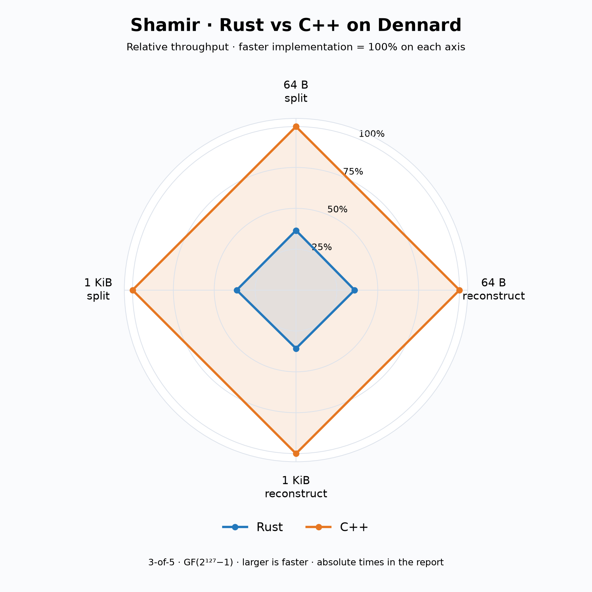
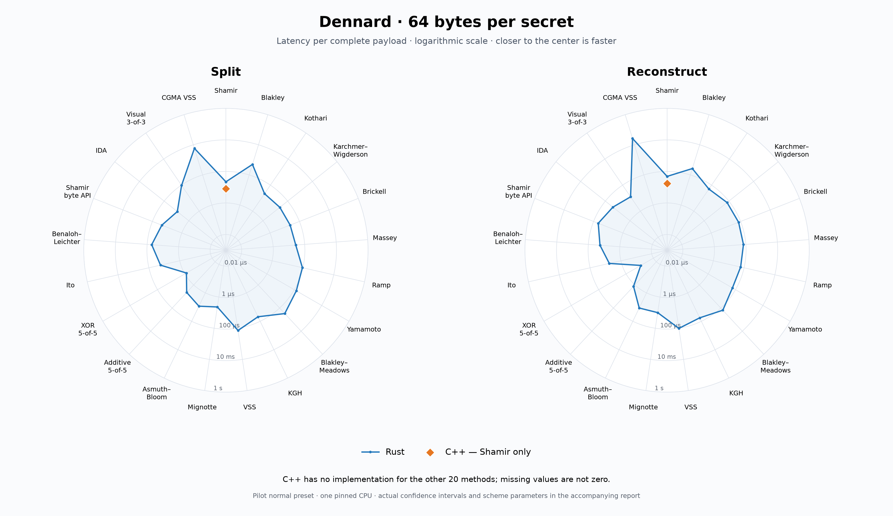
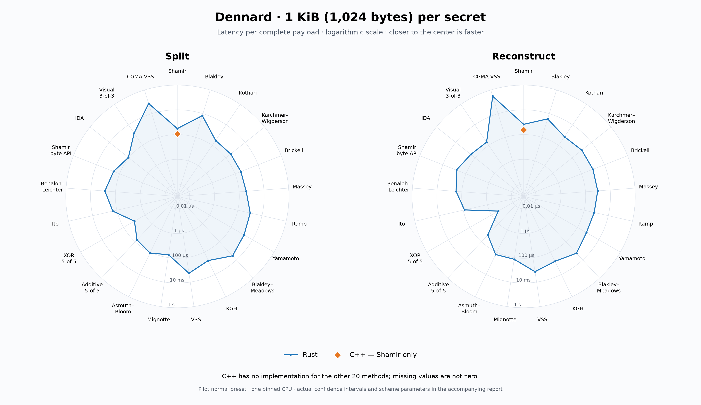

# Dennard: 64-byte and 1 KiB secret-sharing payloads

**C++ Shamir is about 2.8× faster than Rust in these four shared workloads.** All 88 supported measurements converged under Pilot's normal preset. The sweep covers all 21 Rust sharing methods at both sizes and both phases. C++ implements only Shamir; its other 80 size/phase cells are explicitly missing, not zero.

## Rust versus C++

Mean milliseconds per complete payload, with **± half-width** of the 95% confidence interval. C++ speedup is Rust latency divided by C++ latency. The denominator is an entire secret payload, not one field element.

| Payload | Phase | Rust ms | C++ ms | C++ speedup | Rounds Rust / C++ |
|---|---|---:|---:|---:|---:|
| 64 B | split | 0.0219726 ± 0.0000327 | 0.0080185 ± 0.0000133 | 2.74× | 140 / 140 |
| 64 B | reconstruct | 0.0484465 ± 0.0000636 | 0.0173706 ± 0.0000302 | 2.79× | 80 / 51 |
| 1024 B | split | 0.3012660 ± 0.0005261 | 0.1093320 ± 0.0002004 | 2.76× | 80 / 80 |
| 1024 B | reconstruct | 0.6693290 ± 0.0011053 | 0.2389670 ± 0.0002772 | 2.80× | 110 / 50 |



The Shamir radar normalizes each axis to the faster implementation: larger is faster. It contains four measured points for each language. The full-method radars below use absolute latency on a logarithmic scale: closer to the center is faster. Blue is Rust, orange is C++. The orange point is Shamir; no C++ polygon is invented for missing methods.





## Measurement conditions

- Machine: dennard, two AMD EPYC 7452 processors, 32 cores per socket, Ubuntu Linux x86-64. Every benchmark process and its Pilot controller pinned to logical CPU 4; measurements run sequentially, with Rust/C++ order alternated for the shared cases.
- Source: `801276a0d5eb8180cd4b7a67270a58dcc86eaa23`, containing integrated arithmetic commit `6f8e9ac1bf5b702fbdcb0022cb436ab5c802d4b1`.
- Arithmetic dependency: rump `01e1c1ebfb84dd9eb0faf9e6335a386d5870f572`, rust-mp 0.1.1.
- Compilers: Rust 1.95.0 (Cargo release), GCC 13.3.0 (CMake Release, library LTO enabled). These compare the repository's release configurations, not identical compiler pipelines. No special `target-cpu=native` or `-march=native` override.
- Pilot 0.14, commit `0f3cb4f5983f421a456b05fe2dca6e5eaa9f1846`. Normal preset: at least 50 subsession samples, full 95% CI width at most 10% of the mean, autocorrelation limit ±0.2. The latency performance indicator is an ordinary value. Raw sample counts may exceed the minimum.
- Each driver sample processes complete payloads for at least 20 ms; slower operations run at least once. Both use the same deterministic non-secret input and RNG seed. A checked round trip precedes every timed sample.
- Scalar field methods use 15-byte chunks in GF(2^127−1): five chunks for 64 bytes, 69 for 1 KiB. Input encoding and setup are outside timing. Allocation, arithmetic and result destruction are included. This is not file, network or wire-format throughput.
- Most cases are 3-of-5. Vector sizes, 5-of-5 additive/XOR, 3-of-3 visual sharing, CRT encodings and CGMA verification are specified in [PAYLOAD-HOWTO](../PAYLOAD-HOWTO.md). Different schemes have different security and expansion properties; the plots do not rank interchangeable cryptographic guarantees.
- The source was built and tested on dennard: 64/64 C++ tests and Rust release all-target tests passed. Local ASan/UBSan and independent arithmetic checks passed before publication. A separate known Rust VSS threshold-overflow defect remains outside this integration.
- The shared filesystem's modification times were about six minutes ahead of dennard's wall clock, causing Make warnings. This was a fresh build and every target compiled. Timed intervals use monotonic clocks in both drivers; wall-clock timestamps are provenance only.

## Rust: 64-byte payload

Mean ms/payload ± half-width of the 95% CI; Pilot rounds in parentheses.

| Method | Split | Reconstruct |
|---|---:|---:|
| shamir | 0.0219726 ± 0.0000327 (140) | 0.0484465 ± 0.0000636 (80) |
| blakley | 0.4989410 ± 0.0006069 (179) | 0.2647970 ± 0.0002736 (200) |
| kothari | 0.0219611 ± 0.0000249 (207) | 0.0499452 ± 0.0000790 (50) |
| karchmer_wigderson | 0.0232606 ± 0.0000395 (110) | 0.0717815 ± 0.0001041 (80) |
| brickell | 0.0233725 ± 0.0000230 (81) | 0.0728321 ± 0.0001321 (170) |
| massey | 0.0271313 ± 0.0000390 (110) | 0.0706258 ± 0.0001044 (54) |
| ramp | 0.0927451 ± 0.0001752 (50) | 0.0595972 ± 0.0001066 (50) |
| yamamoto | 0.1398580 ± 0.0001793 (171) | 0.0597717 ± 0.0000735 (112) |
| blakley_meadows | 0.3007160 ± 0.0003892 (50) | 0.1540750 ± 0.0003156 (110) |
| kgh | 0.0481005 ± 0.0000769 (113) | 0.0572131 ± 0.0000884 (87) |
| vss | 0.1397790 ± 0.0002648 (50) | 0.1026520 ± 0.0001487 (50) |
| mignotte | 0.0043493 ± 0.0000219 (50) | 0.0100037 ± 0.0000144 (58) |
| asmuth_bloom | 0.0086510 ± 0.0000120 (110) | 0.0116455 ± 0.0000170 (52) |
| trivial | 0.0044733 ± 0.0000062 (110) | 0.0013294 ± 0.0000042 (80) |
| trivial_xor | 0.0007698 ± 0.0000014 (50) | 0.0000841 ± 0.0000002 (50) |
| ito | 0.0176446 ± 0.0000265 (55) | 0.0056572 ± 0.0000075 (230) |
| benaloh_leichter | 0.0514574 ± 0.0007067 (50) | 0.0182136 ± 0.0000222 (50) |
| bytes | 0.0227889 ± 0.0000381 (50) | 0.0481795 ± 0.0000719 (80) |
| ida | 0.0086214 ± 0.0000143 (56) | 0.0243845 ± 0.0000440 (50) |
| visual | 0.0958409 ± 0.0001534 (110) | 0.0126631 ± 0.0000443 (80) |
| cgma_vss | 5.8007500 ± 0.0098191 (50) | 26.3311000 ± 0.0443758 (50) |

## Rust: 1024-byte payload

Mean ms/payload ± half-width of the 95% CI; Pilot rounds in parentheses.

| Method | Split | Reconstruct |
|---|---:|---:|
| shamir | 0.3012660 ± 0.0005261 (80) | 0.6693290 ± 0.0011053 (110) |
| blakley | 6.8549300 ± 0.0121140 (110) | 3.6137500 ± 0.0061233 (80) |
| kothari | 0.2996880 ± 0.0003924 (140) | 0.6893490 ± 0.0009165 (80) |
| karchmer_wigderson | 0.3187480 ± 0.0003897 (80) | 0.9901920 ± 0.0018228 (56) |
| brickell | 0.3174930 ± 0.0006635 (80) | 1.0016200 ± 0.0015904 (50) |
| massey | 0.3703860 ± 0.0005663 (170) | 0.9731660 ± 0.0012017 (52) |
| ramp | 1.0705800 ± 0.0017860 (50) | 0.6838640 ± 0.0008690 (51) |
| yamamoto | 1.6355000 ± 0.0023142 (80) | 0.7005620 ± 0.0011127 (50) |
| blakley_meadows | 3.5265100 ± 0.0047156 (232) | 1.8294600 ± 0.0029304 (50) |
| kgh | 0.5618720 ± 0.0006548 (80) | 0.6591360 ± 0.0010535 (110) |
| vss | 1.9016900 ± 0.0025569 (50) | 1.4194900 ± 0.0017925 (144) |
| mignotte | 0.0585139 ± 0.0002754 (50) | 0.1365170 ± 0.0002379 (51) |
| asmuth_bloom | 0.1192340 ± 0.0001250 (114) | 0.1626060 ± 0.0002274 (140) |
| trivial | 0.0604663 ± 0.0000920 (110) | 0.0179362 ± 0.0000254 (80) |
| trivial_xor | 0.0098617 ± 0.0000130 (80) | 0.0002356 ± 0.0000004 (50) |
| ito | 0.2182150 ± 0.0004635 (200) | 0.0783204 ± 0.0001482 (80) |
| benaloh_leichter | 0.7234570 ± 0.0019376 (50) | 0.2914210 ± 0.0005288 (50) |
| bytes | 0.3328060 ± 0.0006030 (114) | 0.6722870 ± 0.0010235 (50) |
| ida | 0.1117680 ± 0.0001624 (50) | 0.2812620 ± 0.0003664 (50) |
| visual | 1.5250700 ± 0.0022728 (110) | 0.2027560 ± 0.0004551 (50) |
| cgma_vss | 72.7589000 ± 0.0808805 (50) | 298.6660000 ± 0.1591565 (50) |

## Reproduce and inspect

Build and run as described in [PAYLOAD-HOWTO](../PAYLOAD-HOWTO.md). Use the source and rump commits above for this version of the experiment. `scripts/bench_payload.py` saves all Pilot exports. The published runner now reads the exported CSV directly; the measured run used the same command construction and extracted console summaries. This report and its charts use the more precise `pi_results.csv` values.

With Python, NumPy and Matplotlib installed:

```sh
python3 scripts/chart_payload.py /path/to/pilot-results benchmarks/dennard-rerun
```

- [Machine-readable measurements](measurements.csv), [full measurement commands and status](measurements.json), [host/toolchain metadata](metadata.json).
- [Complete raw Pilot exports and logs](pilot-raw.tar.gz), [SHA-256 checksums](SHA256SUMS).
- [Vector Shamir chart](radar-shamir.svg), [vector 64-byte chart](radar-64.svg), [vector 1 KiB chart](radar-1024.svg).

The raw archive contains exactly the 88 measured sessions, plus run metadata and coverage records. Every measured session exited successfully and met the requested CI; unsupported C++ cells have no sessions.
